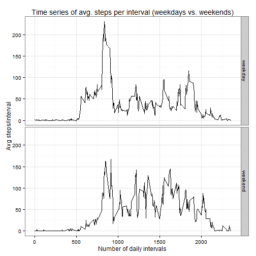

## Loading and preprocessing the data
Loading the required data

```r
# downlaoding and reading the data (personal monitoring devide)
if (!file.exists("repdata-data-activity.zip")) {
        dataSource <- "https://d396qusza40orc.cloudfront.net/repdata%2Fdata%2Factivity.zip"
        download.file(url = dataSource, destfile = "repdata-data-activity.zip", mode = 'wb', cacheOK=FALSE)
        unzip(zipfile = "repdata-data-activity.zip")
        data <- read.csv("activity.csv")        
        } else {
                if (!file.exists("activity.csv")) {
                unzip(zipfile = "repdata-data-activity.zip")
                data <- read.csv("activity.csv")
                } else {
                        data <- read.csv("activity.csv")
                }
}
# loading required packages
library(ggplot2)
library(dplyr)
```

Preprocessing required

```r
# date column as date format
data$date <- as.Date(data$date)
```

## What is mean total number of steps taken per day?
Calculation of total number of steps/day (ignoring missing values)

```r
Tsteps <- data %>%
                group_by(date) %>%
                summarise(total=sum(steps))
```
Histogram of the total number of steps taken each day

```r
ggplot(Tsteps, aes(total)) + geom_histogram(binwidth=1000, fill="cornsilk", 
        colour="grey40") + theme_bw() + labs(x="Total steps/day", y="Frequency",
        title= "Freq. distribution of Steps/day") +
        geom_vline(aes(xintercept=mean(Tsteps$total, na.rm=T)),
                   colour="#468966", size=1.5) +
        geom_vline(aes(xintercept=median(Tsteps$total, na.rm=T)),
                   colour="#FFB03B", size=1.5, linetype="dashed")
```

 

```r
# mean and median
avg <- mean(Tsteps$total, na.rm = T)
med <- median(Tsteps$total, na.rm = T)
avg # Orange vertical line
```

```
## [1] 10766.19
```

```r
med # Green vertical line
```

```
## [1] 10765
```

As is eident on the chart above, the distribution of steps/day is highly simetrical, centrilised around **10765** steps per day. With the mean and the median virtually ovelapping around the same data point. 

## What is the average daily activity pattern?
Calculation of average number of steps per Interval (ignoring missing values)

```r
# Avg steps/interval
Msteps <- data %>%
                group_by(interval) %>%
                summarise(avg=mean(steps, na.rm=T))
# Interval with max # of steps
maxint <- Msteps$interval[which.max(Msteps$avg)]

# Time series chart
ggplot(Msteps, aes(interval,avg)) + geom_line() + theme_bw() +
        labs(x="Number of daily intervals", y="Avg steps/interval",
        title= "Time series of avg. steps per interval") +
        geom_vline(aes(xintercept= maxint,
                   colour="#9966CC"))
```

 

The chart above show that the **835** interval is the 5-minute interval, that across all the days in the dataset, contains the maximum number of steps with **206** average steps.

## Imputing missing values

Counting the number of missing values (i.e. NAs)

```r
numNA <- sum(is.na(data$steps))
numNA
```

```
## [1] 2304
```
The total number of observations missing values (i.e. NAs) is **2304**. A mere **13.11%** of the total number of observations. These missing values will be **imputed by simply using the average number of steps per interval** (which we have already calculated)

```r
# First create a copy of the data set, to be imputed (dataNoNa)
dataNoNa <- data

# Write a function that identifies the intervals with NAs and calls the respective avg. value
for (i in 1:nrow(dataNoNa)){
        if(is.na(dataNoNa$steps[i])){
                x <- dataNoNa$interval[i]
                row <- which(Msteps$interval==x)
                y <- Msteps$avg[row]
                dataNoNa$steps[i] <- y
        }
}
```
New histogram  of total number of steps per day with new imputed values

```r
# total steps imputed data
Tsteps2 <- dataNoNa %>%
                group_by(date) %>%
                summarise(total=sum(steps))

ggplot(Tsteps2, aes(total)) + geom_histogram(binwidth=1000, fill="cornsilk", 
        colour="grey40") + theme_bw() + labs(x="Total steps/day", y="Frequency",
        title= "Freq. distribution of Steps/day (imputed dataset)") +
        geom_vline(aes(xintercept=mean(Tsteps2$total, na.rm=T)),
                   colour="#468966", size=1.5) +
        geom_vline(aes(xintercept=median(Tsteps2$total, na.rm=T)),
                   colour="#FFB03B", size=1.5, linetype="dashed")
```

 

```r
# meand and median
avg2 <- mean(Tsteps2$total)
med2 <- median(Tsteps2$total)
avg2 # Orage vertical line
```

```
## [1] 10766.19
```

```r
med2 # Green vertical line
```

```
## [1] 10766.19
```

As expected, the new distibution is very similar to the one with missing values. **With an increase on the mode of over 75%.**  Furthermore, as averages were used to imput the missing values, the variance (spread) was significately reduced. This can be better observed on the boxplot below.

```r
boxplot(Tsteps$total,Tsteps2$total, names = c("Original", "Imputed"), ylab="Total Steps/day", main="Comparison between Original and Imputed data")
```

 

## Are there differences in activity patterns between weekdays and weekends?

To answer this question, I created a new factor variable in the dataset (Imputed data) with two levels - "weekday" and "weekend" indicating whether a given date is a weekday or weekend day.

```r
# Week split between workdays and weekends
week <- factor(weekdays(dataNoNa$date) %in% c("Saturday","Sunday"), 
               labels=c("weekday","weekend"), ordered=FALSE)

# Checking outcome
table(week)
```

```
## week
## weekday weekend 
##   12960    4608
```

```r
# Combining imputed data with day classification to get activity pattern between workdays and weekends
dataNoNa <- cbind(dataNoNa,week)

# New average of steps per Interval/day of week
TstepsW <- dataNoNa %>%
        group_by(interval,week) %>%
        summarise(avg = mean(steps))
```
New time series panel chart showing the difference between weekdays and weekends

```r
# Time series panel chart
ggplot(TstepsW, aes(interval,avg)) + geom_line() + 
        labs(x="Number of daily intervals", y="Avg steps/interval", title="Time series of avg. steps per interval (weekdays vs. weekends)") + 
        theme_bw() + facet_grid(week ~ .)
```

 

As can be seen from the charts above, the walking patterns between workdays and weekends **are, on average, significantly different**. While workdays present a distinctive peak of activity during the early interval measurements of the day, weekends' activity seems more homogeneous across intervals. Further investigation would be required to identify how these patterns change by day of the week.
